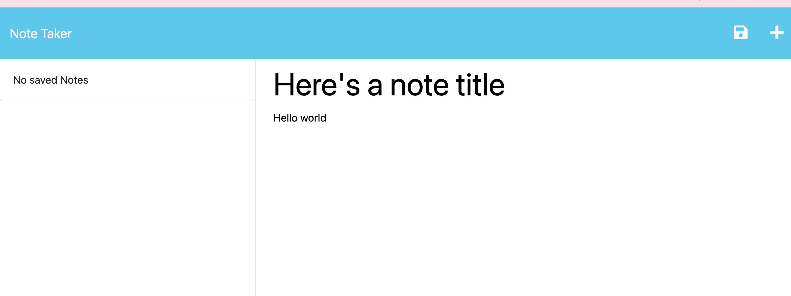

  # Note Taker

  ## Description
  An application that can write and save notes.

  ## Table of Contents
  - [Installation](#installation)
  - [Usage](#usage)
  - [Links](#links)
  - [Screenshot](#screenshot)
  - [Questions](#questions)
  
  ## Installation
  Run using ```npm run start```
  
  ## Usage
  Write a note title and a note on the main page after redirecting from the starting splash page.  Click the save icon to save the note.
  
  ## Links
  [GitHub Repository](https://github.com/skip-thurm/note-taker)

  [Deployed Application](https://note-taker-00.herokuapp.com/)

  ## Screenshot

  
  
  ## Questions
  GitHub Username:

  [skip-thurm](https://github.com/skip-thurm)

  You can reach me with any questions at:
  
  <slthurman01@gmail.com>
